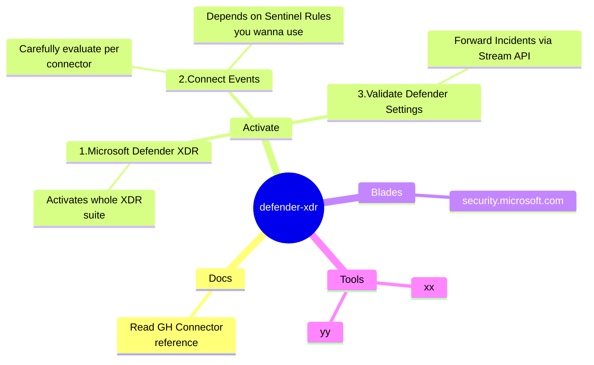

`connector:` `Microsoft Defender XDR`

Reference:
- https://github.com/MicrosoftDocs/azure-docs/blob/main/articles/sentinel/connect-microsoft-365-defender.md
- https://github.com/MicrosoftDocs/azure-docs/blob/main/articles/sentinel/microsoft-365-defender-sentinel-integration.md

---

## Implementation Mindmap

## Special Hints
