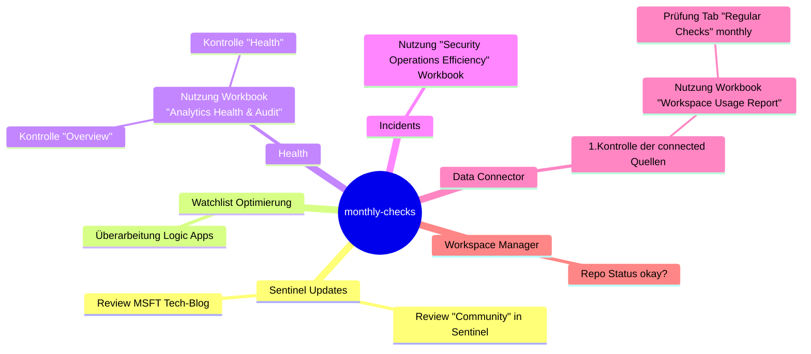

`©️ 2024 zerohat Consulting` \
`Hinweis: kein Anspruch auf Vollständigkeit, selber mitdenken - Copy & Innovate!`

---

# SENTINEL (SOC) Operator (LEVEL 2)

## DAILY Checks

---

## Online References

- https://learn.microsoft.com/en-us/azure/security/fundamentals/operational-checklist
- https://learn.microsoft.com/en-us/azure/sentinel/whats-new
- https://danielchronlund.com/wp-content/uploads/2022/09/microsoft-sentinel-soc-activities.pdf
